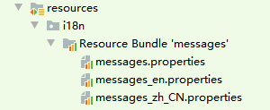

# 异常处理
## 异常类型
### 1. 非受检异常`(unchecked exceptions)`
#### 解释：
1. 非受检异常不捕获不会引起编译失败。
1. 非受检异常会引发事务的自动回滚，一般用于业务逻辑。
1. 非受检异常的基类是`java.lang.RuntimeException`

#### 类：
* 业务异常 [BusinessException](../../lemon-boot-project/lemon-boot-framework/src/main/java/com/lemon/framework/exception/BusinessException.java)
    (默认代码：400)
* 乐观锁异常 [ConflictException](../../lemon-boot-project/lemon-boot-framework/src/main/java/com/lemon/framework/exception/ConflictException.java)
    (默认代码：REV-CONFLICT)
* 业务禁用异常 [ForbiddenException](../../lemon-boot-project/lemon-boot-framework/src/main/java/com/lemon/framework/exception/ForbiddenException.java)
    (默认代码：403)
* 不可接受的内容 [NotAcceptableException](../../lemon-boot-project/lemon-boot-framework/src/main/java/com/lemon/framework/exception/NotAcceptableException.java)
    (默认代码：406)
* 内容未找到 [NotFoundException](../../lemon-boot-project/lemon-boot-framework/src/main/java/com/lemon/framework/exception/NotFoundException.java)
    (默认代码：404)
* 未授权的访问 [AuthorizationException](../../lemon-boot-project/lemon-boot-framework/src/main/java/com/lemon/framework/exception/AuthorizationException.java)
    (默认代码：403)
* 身份验证失败 [AuthenticationException](../../lemon-boot-project/lemon-boot-framework/src/main/java/com/lemon/framework/exception/AuthenticationException.java)
    (默认代码：401)
* 应用系统异常 [SystemException](../../lemon-boot-project/lemon-boot-framework/src/main/java/com/lemon/framework/exception/SystemException.java)
    (默认代码：500)

>`BusinessException`是除`ApplicationException`外的父类异常，
>未分类的业务异常都可以使用。<br/>
>业务类异常推荐使用`BusinessException`<br/>
>

### 2. 受检异常`(checked exceptions)`
#### 解释：
1. 受检异常必须`catch`捕获处理，或明确`throw`抛出。
1. 受检异常不会引发事务的自动回滚。
1. 受检异常的基类是`java.lang.Exception`

注意：
> 受检异常不会引发事务的自动回滚，因此仅限用于底层系统异常，不能用于业务逻辑。<br/>
> 且抛出后必须明确处理，或补偿修复或由非受检异常包装后（回滚事务）抛回给前台。

#### 类：
* 系统异常 [SystemException](../../lemon-boot-project/lemon-boot/src/main/java/com/lemon/framework/exception/sys/SystemException.java)

### 3. 最佳实践
1. 普通业务逻辑异常请使用`BusinessException`<br/>
   比如 “此优惠券不能重复领取！”
2. 其他很明确的业务异常可以视情况决定使用哪种<br/>
   比如 “单据未找到！” 就可以使用`NotFoundException`
3. 底层系统级异常应该使用`SystemException`<br/>
   比如 “Redis服务器连接失败”、“文件创建失败”等
   
   ```
    public void createPath(String rootLocation) {
        try {
            Files.createDirectories(rootLocation);
        } catch (IOException e) {
            throw new SystemException("Local path creation failed: " + storagePath, e);
        }
    }
   ```
   
4. 以上所有异常都具有唯一的ID，同时记录自身是否已被写过日志，可以与某些日志框架搭配避免同一异常重复被记录！
   
   ```
   // 获取唯一ID
   getUniqueID();
   
   // 是否被记录
   if (getLogged()) ...
   
   // 标记为已记录
   setLogged(true);
   ```

## i18n
1. i18n资源文件如图所示

    

1. `application.yml`配置

    ```
    zh:
    http:
      accept-language:
        # 请求国际化是否通过请求参数指定
        # request-param-lang：通过参数指定 - .../api?lang=zh_CN
        # header-accept-language: 通过头指定 - Accept-Language=zh_CN
        type: request-param-lang
    
    spring:
    messages:
      # 必须指定文本的路径
      basename: i18n/messages
      encoding: UTF-8
      # 如果不配置则永久缓存
      cache-duration: 3600
    ```
 
1. 开启国际化消息

  `@EnableLocaleMessage`

### 示例
#### i18n测试工程：[lemon-boot-web-test](../../lemon-boot-tests/lemon-boot-web-tests/lemon-boot-web-test)

* 使用示例
  * 普通文本示例
  
  ```
  message.properties:
    YOUR-NAME-AND-AGE=你的名字是{0}，年龄{1}。
  
  java:
    String text = messageSourceHandler.getMessage("YOUR-NAME-AND-AGE", "Tony", 18);
  ```

  * 异常示例
  
  ```
  message.properties:
    STORAGE-1001=本地路径创建失败: {0}
  
  java:
    throw new SystemException("STORAGE-1001", filepath);
  ```

> 请维护自己的message.properties
